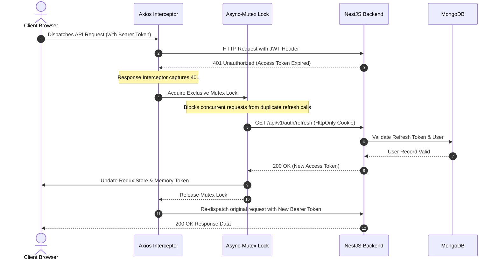
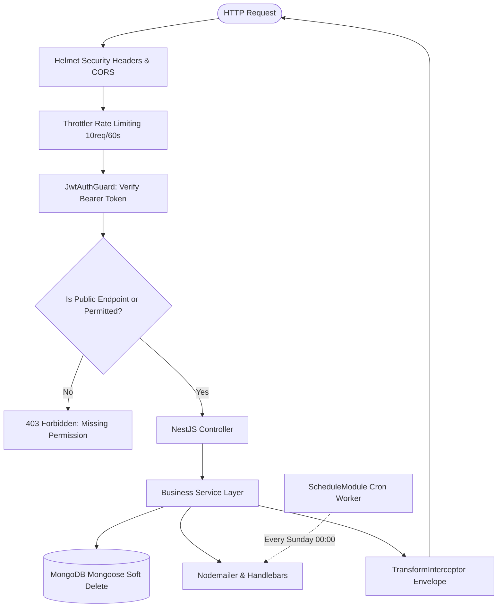

<div align="center">

# 💼 Jobs Hunter — Enterprise Recruitment & Career Platform

<p align="center">
  <strong>A production-ready, full-stack recruitment platform and talent acquisition ecosystem engineered with NestJS, React 18, TypeScript, MongoDB, Dynamic RBAC, and Automated Skill-Matching Newsletters.</strong>
</p>

<p align="center">
  <a href="https://nestjs.com/"></a>
  <a href="https://react.dev/"></a>
  <a href="https://www.typescriptlang.org/"></a>
  <a href="https://www.mongodb.com/"></a>
  <a href="https://ant.design/"></a>
  <a href="https://vitejs.dev/"></a>
  <a href="https://www.docker.com/"></a>
  <a href="https://swagger.io/"></a>
</p>

---

[🚀 Introduction](#-introduction) •
[✨ Features](#-features) •
[🛠 Tech Stack](#-tech-stack) •
[📂 Project Structure](#-project-structure) •
[⚙️ Installation](#️-installation) •
[▶️ Usage](#️-usage) •
[🔌 API Documentation & Integration](#-api-documentation--integration) •
[🧱 System Architecture](#-system-architecture) •
[🧪 Future Improvements](#-future-improvements) •
[👨‍💻 Author](#-author)

---

</div>

## 🚀 Introduction

**Jobs Hunter** is an enterprise-grade, full-stack recruitment platform designed to seamlessly connect job seekers, enterprise recruiters (HR), and system administrators. The platform delivers an end-to-end talent acquisition lifecycle—from job discovery, multi-criteria vacancy searching, and instant CV submission to applicant tracking (ATS), company onboarding, granular role-based access control (RBAC), and automated weekly skill-matching email digests.

Built with a modern full-stack architecture:
- **Backend**: Engineered with **NestJS 9**, **TypeScript**, and **MongoDB (Mongoose)**, following clean modular design patterns, dependency injection, global interceptors, custom decorators, rate limiting, and automated cron background workers.
- **Frontend**: A high-performance Single Page Application (SPA) built with **React 18**, **Vite (SWC)**, **TypeScript**, **Ant Design 5**, **Ant Design Pro Components**, and **Redux Toolkit**, featuring a race-condition-safe authentication flow and a dynamic permission-driven interface.

---

## ✨ Features

### 👨‍💼 1. Candidate / Job Seeker Portal
- **Smart Job Search & Filtering**: Multi-criteria search by keyword, geographic location (Hanoi, Ho Chi Minh, Da Nang, Remote, etc.), and multi-select technology skills (React, Node.js, TypeScript, Python, etc.).
- **Company Showcase Directory**: Explore verified employer profiles, headquarters, company scale, office locations, and real-time open vacancies.
- **Instant CV Application**: One-click application modal supporting multipart file uploads (`.pdf`, `.doc`, `.docx`) with validation and size restrictions.
- **Application Tracking Dashboard**: Candidates can track the status of their submitted CVs in real time (`PENDING`, `REVIEWING`, `APPROVED`, `REJECTED`) along with status history logs.
- **Job Alert Subscriptions**: Subscribe email preferences to specific technology stacks to receive automated weekly job match notifications.

### 🏢 2. HR & Enterprise Recruiter Workflow
- **Multi-Tenant / Company-Scoped Access**: Strict tenant isolation ensures HR accounts only manage jobs and applicant resumes belonging to their assigned company.
- **Job Vacancy Management**: Rich-text job descriptions via **ReactQuill**, debounce company search, salary formatting, seniority level categorisation (`INTERN`, `FRESHER`, `JUNIOR`, `MIDDLE`, `SENIOR`), headcount limits, and active date range scheduling.
- **Applicant Tracking System (ATS)**: Live resume review drawer, CV preview, status transition management, and audit trailing for application updates.

### 🛡️ 3. Super Admin & Governance Portal
- **Interactive Analytics Dashboard**: Platform overview metrics with real-time animated counters (`react-countup`) tracking total users, companies, active jobs, and submitted resumes.
- **Dynamic RBAC Permission Engine**: Granular database-driven permission checking matching HTTP `Method` + `ApiPath`.
- **Role Matrix Builder**: Create custom roles with tailored permission sets; the frontend dynamically controls route access, admin sidebar navigation items, and action buttons (`Create`, `Edit`, `Delete`) based on the authenticated user's permissions.
- **User & Company Administration**: Complete CRUD operations for user accounts, role assignments, and enterprise company profiles.

### ⚡ 4. Enterprise Architecture & Security
- **Dual-Token Authentication**: Secure authentication using Access Tokens in memory and Refresh Tokens stored in secure, `HttpOnly` cookies.
- **Race-Condition-Safe Silent Refresh**: Frontend Axios response interceptor utilizes `async-mutex` locking to prevent duplicate concurrent refresh requests.
- **HTTP Header Security & Rate Limiting**: Protected with **Helmet** and rate-limited via `@nestjs/throttler` (10 requests / 60 seconds) against DDoS and brute-force attacks.
- **Soft Deletion & Audit Trail**: Mongoose soft delete plugin (`soft-delete-plugin-mongoose`) tracks `isDeleted`, `deletedAt`, and `deletedBy` across all collections without losing relational integrity.
- **Automated Cron Email Worker**: Weekly scheduled cron task (`@nestjs/schedule`) delivering personalized HTML email newsletters via **Nodemailer** and **Handlebars** templates to skill subscribers.
- **System Observability & Docs**: Live MongoDB health checks via `@nestjs/terminus` (`/api/v1/health`), OpenAPI interactive documentation via **Swagger**, and code architecture diagrams via **Compodoc**.

---

## 🛠 Tech Stack

### Backend Architecture

| Layer / Capability | Technology | Version | Purpose / Highlights |
| :--- | :--- | :--- | :--- |
| **Framework** | [NestJS](https://nestjs.com/) | `9.0.0` | Enterprise Node.js framework with modular architecture & DI |
| **Language** | [TypeScript](https://www.typescriptlang.org/) | `5.x` | Strict type safety, interfaces, and metadata decorators |
| **Database** | [MongoDB](https://www.mongodb.com/) / [Mongoose](https://mongoosejs.com/) | `7.1.0` | Schema-driven document database with soft-delete capabilities |
| **Authentication & Security** | [Passport.js](http://www.passportjs.org/) / [JWT](https://jwt.io/) | `10.0.3` | Dual-token strategy (Access Token + HttpOnly Refresh Token) |
| **Security Headers** | [Helmet](https://helmetjs.github.io/) | `7.0.0` | Configures secure HTTP response headers |
| **Rate Limiting** | [@nestjs/throttler](https://docs.nestjs.com/security/rate-limiting) | `4.1.0` | API rate limiting and brute-force protection |
| **Validation & DTOs** | [class-validator](https://github.com/typestack/class-validator) | `0.14.0` | Declarative payload validation and whitelist sanitization |
| **Background Tasks** | [@nestjs/schedule](https://docs.nestjs.com/techniques/task-scheduling) | `3.0.1` | Automated cron job runner for subscriber matching emails |
| **Email Transport** | [Nodemailer](https://nodemailer.com/) / [Handlebars](https://handlebarsjs.com/) | `6.9.3` | Asynchronous email delivery with dynamic responsive templates |
| **API Documentation** | [Swagger (OpenAPI)](https://swagger.io/) | `7.0.4` | Interactive OpenAPI documentation with Bearer Auth |
| **Health Monitoring** | [@nestjs/terminus](https://docs.nestjs.com/recipes/terminus) | `10.0.1` | MongoDB live connection health check endpoint |
| **DevOps** | [Docker](https://www.docker.com/) / Compose | Multi-stage | Containerized packaging for seamless staging & production |

### Frontend Architecture

| Layer / Capability | Technology | Version | Purpose / Highlights |
| :--- | :--- | :--- | :--- |
| **Core Framework** | [React](https://react.dev/) | `18.2.0` | Declarative UI library with Concurrent Mode support |
| **Language** | [TypeScript](https://www.typescriptlang.org/) | `5.3.3` | Static typing, custom generic interfaces, and strict checking |
| **Build Tool & HMR** | [Vite](https://vitejs.dev/) + SWC | `4.2.0` | High-speed build tooling and instant Hot Module Replacement |
| **UI Design System** | [Ant Design](https://ant.design/) | `5.13.1` | Enterprise UI component system |
| **Pro Layouts & Tables** | [@ant-design/pro-components](https://procomponents.ant.design/) | `2.6.46` | Advanced ProTable layouts, editable forms, and toolbar actions |
| **State Management** | [Redux Toolkit](https://redux-toolkit.js.org/) | `1.9.3` | Centralized state container for auth, accounts, and session data |
| **Client Routing** | [React Router DOM](https://reactrouter.com/) | `6.11.2` | Declarative client-side routing, protected routes, and layout loaders |
| **HTTP Client** | [Axios](https://axios-http.com/) | `1.6.5` | Promise-based HTTP client with request/response interceptors |
| **Concurrency Control** | [Async-Mutex](https://github.com/DirtyHairy/async-mutex) | `0.4.0` | Mutex lock mechanism preventing duplicate token refresh calls |
| **Rich Text Editor** | [React-Quill](https://github.com/zenoamaro/react-quill) | `2.0.0` | WYSIWYG editor for job requirements and job descriptions |
| **Date & Time Utility** | [Day.js](https://day.js.org/) | `1.11.8` | Lightweight date formatting and relative time computation |
| **Styling** | [Sass / SCSS Modules](https://sass-lang.com/) | `1.62.1` | Scoped and structured stylesheet architecture |

---

## 📂 Project Structure

```text
job-hunter-nestjs/
├── backend/                             # NestJS RESTful API Backend
│   ├── public/                          # Static file uploads (company logos, CVs)
│   ├── views/                           # Server-rendered views & email templates
│   ├── src/
│   │   ├── auth/                        # JWT & Local auth, passport strategies, guards, decorators
│   │   ├── users/                       # User management module, service, schemas, DTOs
│   │   ├── companies/                   # Company directory & profile management
│   │   ├── jobs/                        # Job postings, search queries, pagination
│   │   ├── resumes/                     # CV submission, review workflow & history logs
│   │   ├── permissions/                 # Dynamic RBAC API permissions
│   │   ├── roles/                       # Dynamic roles & permission assignment
│   │   ├── subscribers/                 # Skill subscribers & email preferences
│   │   ├── files/                       # Multer upload module with format/size validation
│   │   ├── mail/                        # Nodemailer service, templates & cron job runner
│   │   ├── health/                      # Terminus healthcheck module (/api/v1/health)
│   │   ├── databases/                   # Database seeder & default admin initialization
│   │   ├── core/                        # Global interceptors & transform filters
│   │   ├── app.module.ts                # Application root module
│   │   └── main.ts                      # Bootstrap entry point (Swagger, CORS, Helmet)
│   ├── Dockerfile                       # Multi-stage production container build
│   ├── docker-compose.yml               # Container orchestration
│   └── package.json
│
├── frontend/                            # React 18 + TypeScript + Vite Frontend
│   ├── public/                          # Public static assets & favicons
│   ├── src/
│   │   ├── assets/                      # Vector illustrations, icons & brand graphics
│   │   ├── components/
│   │   │   ├── admin/                   # Admin portal components (User, Job, Role, ATS Resume, etc.)
│   │   │   ├── client/                  # Candidate portal components (Job card, Header, Search bar, Modals)
│   │   │   └── share/                   # Reusable components (Access guard, Loading, Protected routes)
│   │   ├── config/
│   │   │   ├── api.ts                   # Centralized API service methods
│   │   │   ├── axios-customize.ts       # Axios client configured with Async-Mutex token refresh
│   │   │   ├── permissions.ts           # Permission mapping & module constants
│   │   │   └── utils.ts                 # Shared utilities, skill tags, formatters
│   │   ├── pages/
│   │   │   ├── admin/                   # Admin pages (Dashboard, Jobs, Companies, Users, Roles, ATS)
│   │   │   ├── auth/                    # Login & Register views
│   │   │   ├── company/                 # Company listing & detail views
│   │   │   ├── home/                    # Public landing homepage
│   │   │   └── job/                     # Public job board & job detail views
│   │   ├── redux/                       # Redux Toolkit store, slices, and typed hooks
│   │   ├── styles/                      # Global styles and SCSS modules
│   │   ├── types/                       # TypeScript interfaces & backend DTO typings
│   │   ├── App.tsx                      # Root router configuration
│   │   └── main.tsx                     # React DOM entry point
│   ├── vite.config.ts                   # Vite configuration
│   └── package.json
│
└── README.md                            # Monorepo documentation
```

---

## ⚙️ Installation

### Prerequisites
- **Node.js**: `v18.x` or higher
- **npm**: `v9.x` or higher
- **MongoDB**: Local MongoDB instance or MongoDB Atlas connection URI
- **Docker & Docker Compose** (Optional, for containerized execution)

---

### 1. Clone the Repository

```bash
git clone https://github.com/NguyenTanNghi/Jobs_Hunter_NestJS.git
cd Jobs_Hunter_NestJS
```

---

### 2. Backend Setup

#### a. Install dependencies
```bash
cd backend
npm install --legacy-peer-deps
```

#### b. Configure environment variables
Create a `.env` file in the `backend/` directory:

```env
# Application Port
PORT=8000

# Database Connection
MONGODB_URL=mongodb+srv://<username>:<password>@cluster0.mongodb.net/jobhunter

# JWT Authentication
JWT_ACCESS_TOKEN_SECRET=your_super_secret_access_key
JWT_ACCESS_EXPIRE=1d
JWT_REFRESH_TOKEN_SECRET=your_super_secret_refresh_key
JWT_REFRESH_EXPIRE=7d

# Initial Data Seeding Password
INIT_DATA_PASSWORD=your_initial_admin_password

# Email Service (SMTP)
EMAIL_HOST=smtp.gmail.com
SENDER_EMAIL=your_email@gmail.com
PASSWORD_EMAIL=your_gmail_app_password
EMAIL_PREVIEW=false
```

---

### 3. Frontend Setup

#### a. Install dependencies
```bash
cd ../frontend
npm install
```

#### b. Configure environment variables
Create `.env.development` and `.env.production` files in the `frontend/` directory:

```env
# .env.development
NODE_ENV=development
PORT=3000
VITE_BACKEND_URL=http://localhost:8000
```

```env
# .env.production
NODE_ENV=production
PORT=3000
VITE_BACKEND_URL=https://api.yourdomain.com
```

---

## ▶️ Usage

### 🧑‍💻 Running in Development Mode

Run backend and frontend concurrently in two separate terminal windows:

```bash
# Terminal 1: Start Backend (NestJS)
cd backend
npm run start:dev
# Backend starts at: http://localhost:8000
# Swagger API docs at: http://localhost:8000/swagger
```

```bash
# Terminal 2: Start Frontend (React + Vite)
cd frontend
npm run dev
# Frontend starts at: http://localhost:3000
```

---

### 📦 Building for Production

```bash
# Compile Backend TypeScript
cd backend
npm run build
npm run start:prod

# Compile Frontend Static Assets
cd ../frontend
npm run build
npm run preview
```

---

### 🐳 Running with Docker

Run the entire backend service in an isolated Docker container:

```bash
cd backend

# Build and start container in detached mode
docker-compose up -d --build

# View real-time container logs
docker logs -f jobhunter_backend

# Stop container
docker-compose down
```

---

### 📚 Generate Architectural Documentation (Compodoc)

Generate structural diagrams and detailed module documentation:

```bash
cd backend
npm run doc
```
> Access Compodoc documentation at: **`http://127.0.0.1:8080`**

---

## 🔌 API Documentation & Integration

### Interactive Swagger UI
The backend provides a fully documented OpenAPI 3.0 specification with interactive JWT Bearer authorization:
> 🔗 **`http://localhost:8000/swagger`**

| Module | Method | Endpoint | Description | Access Level |
| :--- | :---: | :--- | :--- | :--- |
| **Auth** | `POST` | `/api/v1/auth/login` | Authenticate user & issue tokens | Public |
| **Auth** | `POST` | `/api/v1/auth/register` | Register a new candidate account | Public |
| **Auth** | `GET` | `/api/v1/auth/account` | Retrieve current authenticated user info & permissions | Authenticated |
| **Auth** | `GET` | `/api/v1/auth/refresh` | Issue new access token using HttpOnly refresh cookie | Public (Cookie) |
| **Auth** | `POST` | `/api/v1/auth/logout` | Revoke session & clear refresh cookie | Authenticated |
| **Users** | `POST` | `/api/v1/users` | Create user with specified Role & Company | Admin / HR |
| **Users** | `GET` | `/api/v1/users` | Paginated users list with search & filters | Admin / HR |
| **Companies** | `GET` | `/api/v1/companies` | Paginated company directory | Public |
| **Companies** | `POST` | `/api/v1/companies` | Create a new company profile | Admin |
| **Companies** | `PATCH` | `/api/v1/companies/:id` | Update company information | Admin |
| **Jobs** | `GET` | `/api/v1/jobs` | Search and filter job listings (Company-scoped for HR) | Public / Filtered |
| **Jobs** | `POST` | `/api/v1/jobs` | Create a new job listing | Admin / HR |
| **Jobs** | `PATCH` | `/api/v1/jobs/:id` | Update an existing job listing | Admin / HR |
| **Resumes** | `POST` | `/api/v1/resumes` | Submit candidate CV for a job vacancy | Candidate |
| **Resumes** | `POST` | `/api/v1/resumes/by-user`| Get submitted applications for current user | Candidate |
| **Resumes** | `GET` | `/api/v1/resumes` | Retrieve resumes (HR scoped to their company) | Admin / HR |
| **Resumes** | `PATCH` | `/api/v1/resumes/:id` | Update CV application review status (`ATS`) | Admin / HR |
| **Files** | `POST` | `/api/v1/files/upload` | Multipart file upload (images & CV documents) | Authenticated |
| **Subscribers** | `POST` | `/api/v1/subscribers/skills`| Subscribe or update skill email preferences | Authenticated |
| **Health** | `GET` | `/api/v1/health` | MongoDB connection live health check | Public |

---

### Standardized Response Envelope

All API endpoints return responses in a standardized format via NestJS `TransformInterceptor`:

```json
{
  "statusCode": 200,
  "message": "Call API success",
  "data": {
    "meta": {
      "current": 1,
      "pageSize": 10,
      "pages": 5,
      "total": 48
    },
    "result": [ ... ]
  }
}
```

---

## 🧱 System Architecture

### 🔄 Concurrency-Safe Authentication & Token Rotation Flow



---

### 🛡️ Dynamic RBAC Authorization Workflow



---

## 🧪 Future Improvements

- [ ] **Redis Caching Layer**: Cache frequent read-heavy queries (job listings, company catalogs) to optimize response times.
- [ ] **Message Queue (BullMQ / RabbitMQ)**: Decouple newsletter mass-mailing into an asynchronous distributed background job queue.
- [ ] **Elasticsearch Integration**: Implement full-text fuzzy search for candidate CVs and complex job queries.
- [ ] **Real-time Notifications**: Integrate WebSocket / Socket.io for instant candidate status alerts and recruiter messaging.
- [ ] **AI-Powered Resume Matching**: Integrate AI models to calculate match scores between candidate resumes and job descriptions.
- [ ] **CI/CD Pipeline**: Automated testing, linting, and multi-stage Docker builds via GitHub Actions.
- [ ] **Multi-language Support (i18n)**: Implement internationalization for seamless switching between English and Vietnamese.

---

## 👨‍💻 Author

**Nguyễn Tấn Nghị**

- 🌐 GitHub: [@NguyenTanNghi](https://github.com/NguyenTanNghi)
- 💼 Project Repository: [Jobs_Hunter_NestJS](https://github.com/NguyenTanNghi/Jobs_Hunter_NestJS)
- 📧 Email: [nguyentannghi5722.@gmail.com](mailto:nguyentannghi.dev@gmail.com)

---

<div align="center">
  <sub>Built with ❤️ using NestJS, React 18, TypeScript, and MongoDB. If you find this project valuable, please consider starring ⭐️ the repository!</sub>
</div>
