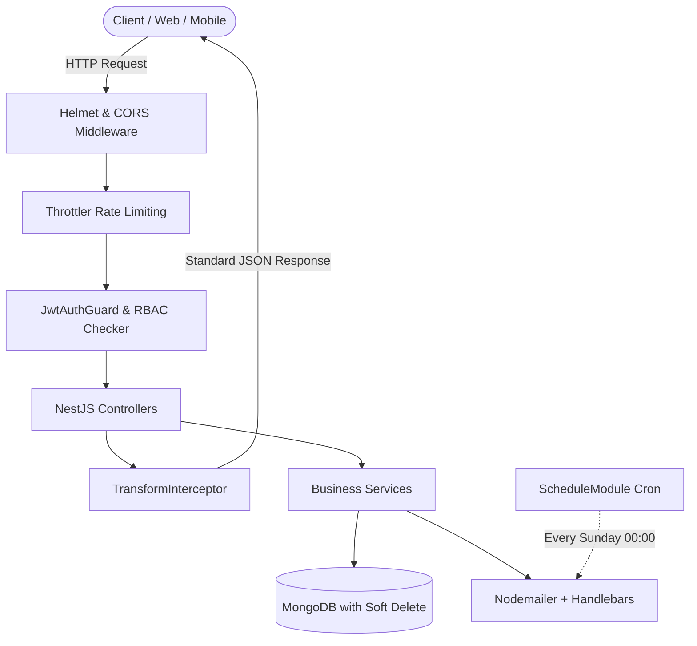

<div align="center">

# 💼 Jobs Hunter - Enterprise NestJS Recruitment Platform

[](https://nestjs.com/)
[](https://www.typescriptlang.org/)
[](https://www.mongodb.com/)
[](https://mongoosejs.com/)
[](https://www.docker.com/)
[](https://swagger.io/)
[](LICENSE)

<p align="center">
  A production-ready, highly scalable RESTful API backend for modern job portal platforms. Built with <b>NestJS</b>, <b>MongoDB</b>, <b>JWT Authentication</b>, <b>Dynamic RBAC</b>, and <b>Automated Cron Email Matching</b>.
</p>

[Explore API Docs](http://localhost:8000/swagger) • [Architecture Docs](http://127.0.0.1:8080) • [Report Bug](https://github.com/NguyenTanNghi/Jobs_Hunter_NestJS/issues)

</div>

---

## 🚀 Introduction

**Jobs Hunter Backend** is a complete, enterprise-grade backend solution designed to power modern recruitment platforms. It manages the full recruitment lifecycle—from job posting, resume submissions, candidate tracking, and company onboarding to dynamic role-based access control (RBAC), automated skill-matching email notifications, and health monitoring.

Engineered following NestJS architectural best practices (modular architecture, dependency injection, global interceptors, custom decorators, and schema-driven data persistence with soft deletion).

---

## ✨ Features

- 🔐 **Dual-Token Authentication**:
  - Secure Local authentication (Passport Local Strategy) + Access/Refresh Token rotation via HTTP-Only cookies.
- 🛡️ **Dynamic Role-Based Access Control (RBAC)**:
  - Database-driven permissions checking matching HTTP `Method` + `ApiPath`.
  - `@Public()` decorator for open endpoints and `@SkipCheckPermission()` for authenticated subscriber operations.
- 🏢 **Multi-Tenant / Company-Scoped Access**:
  - `HR` accounts are strictly isolated to manage only their own company's jobs and candidate resumes.
  - `SUPER_ADMIN` / `ADMIN` retain full system-wide visibility and administrative authority.
- 📄 **Resume & Application Workflow**:
  - Full CV submission pipeline with real-time status tracking (`PENDING`, `REVIEWING`, `APPROVED`, `REJECTED`) and historical audit logs.
- 🔔 **Automated Skill Matching & Scheduled Newsletters**:
  - Automated weekly cron job (`@nestjs/schedule`) triggering personalized job digest emails to subscribers matching their skill profiles via Handlebars (`.hbs`) templates.
- 📁 **Protected File Uploads**:
  - Multer configuration with MIME-type/extension whitelisting, 1MB size enforcement, dynamic folder structure (`public/images/company`, `public/images/resume`), and automatic failure cleanup.
- 🛡️ **Enterprise Security & Rate Limiting**:
  - **Helmet** for HTTP security headers (CSP, XSS, Clickjacking protection).
  - **Throttler Guard** for global rate limiting against Brute-force & DDoS attacks (10 req / 60s).
- 🩺 **Healthchecks & Observability**:
  - `@nestjs/terminus` health checks endpoint (`/api/v1/health`) for MongoDB live connection monitoring.
- 📖 **Interactive OpenAPI & Compodoc Documentation**:
  - Complete Swagger UI with JWT Bearer auth integration and Compodoc for structural code diagrams.
- 🐳 **Containerized & Production Ready**:
  - Multi-stage `Dockerfile` and `docker-compose.yml` optimized for minimal image footprint.

---

## 🛠 Tech Stack

| Layer | Technology | Purpose |
| :--- | :--- | :--- |
| **Framework** | [NestJS 9.x](https://nestjs.com/) | Progressive Node.js framework for scalable server-side applications |
| **Language** | [TypeScript 5.x](https://www.typescriptlang.org/) | Type safety, decorators, and modern ES features |
| **Database** | [MongoDB](https://www.mongodb.com/) / [Mongoose 7.x](https://mongoosejs.com/) | Document database with schema modeling and soft deletion plugin |
| **Security & Auth** | [Passport.js](http://www.passportjs.org/), [JWT](https://jwt.io/), [Helmet](https://helmetjs.github.io/) | Authentication, token rotation, and HTTP header protection |
| **Rate Limiting** | [@nestjs/throttler](https://docs.nestjs.com/security/rate-limiting) | API rate limiting and traffic throttling |
| **Validation** | [class-validator](https://github.com/typestack/class-validator), [class-transformer](https://github.com/typestack/class-transformer) | DTO validation with strict payload whitelisting |
| **Mailing & Templating** | [Nodemailer](https://nodemailer.com/), [Handlebars](https://handlebarsjs.com/) | Asynchronous email transport with responsive HTML templates |
| **Cron Scheduling** | [@nestjs/schedule](https://docs.nestjs.com/techniques/task-scheduling) | Cron-based background workers and task scheduling |
| **API Docs & Monitoring** | [Swagger (OpenAPI)](https://swagger.io/), [Terminus](https://docs.nestjs.com/recipes/terminus), [Compodoc](https://compodoc.app/) | Interactive API docs, system healthchecks, and architectural diagrams |
| **DevOps** | [Docker](https://www.docker.com/), [Docker Compose](https://docs.docker.com/compose/) | Multi-stage containerization and isolated local environments |

---

## 📂 Project Structure

```text
backend/
├── public/                      # Static assets & uploaded images / CVs
├── views/                       # EJS server-rendered templates
├── src/
│   ├── auth/                    # Authentication (JWT, Local strategy, guards, decorators)
│   ├── users/                   # User management module & DTOs
│   ├── companies/               # Company management module & schemas
│   ├── jobs/                    # Job postings & search filters
│   ├── resumes/                 # Resume submission & review workflows
│   ├── permissions/             # Dynamic RBAC API permissions
│   ├── roles/                   # Dynamic roles & permission mapping
│   ├── subscribers/             # Skill subscribers & email subscriptions
│   ├── files/                   # Multer file upload module & storage rules
│   ├── mail/                    # Mailer service, controller & Handlebars templates
│   ├── health/                  # Terminus healthcheck module
│   ├── databases/               # Initial database seeder & sample data
│   ├── core/                    # Global interceptors & transform filters
│   ├── app.module.ts            # Root application module
│   └── main.ts                  # Application bootstrap entry point
├── test/                        # E2E test suites
├── Dockerfile                   # Multi-stage production Docker build
├── docker-compose.yml           # Multi-container orchestration
├── nest-cli.json                # Nest CLI configuration & plugins
├── tsconfig.json                # TypeScript compiler configuration
└── package.json                 # Project dependencies & scripts
```

---

## ⚙️ Installation

### Prerequisites
- **Node.js**: `v18.x` or higher
- **npm**: `v9.x` or higher
- **MongoDB**: Local instance or MongoDB Atlas connection string
- **Docker & Docker Compose** (Optional for containerized run)

### 1. Clone the repository
```bash
git clone https://github.com/NguyenTanNghi/Jobs_Hunter_NestJS.git
cd Jobs_Hunter_NestJS/backend
```

### 2. Install dependencies
```bash
npm install --legacy-peer-deps
```

### 3. Configure Environment Variables
Create a `.env` file in the `backend/` root directory:

```env
# Application Port
PORT=8000

# Database Connection
MONGODB_URL=mongodb+srv://<username>:<password>@cluster0.mongodb.net/jobhunter

# JWT Authentication
JWT_ACCESS_TOKEN_SECRET=your_super_secret_access_key
JWT_ACCESS_EXPIRE=1d
JWT_REFRESH_TOKEN_SECRET=your_super_secret_refresh_key
JWT_REFRESH_EXPIRE=7d

# Initial Data Seeding Password
INIT_DATA_PASSWORD=your_initial_admin_password

# Email Service (SMTP)
EMAIL_HOST=smtp.gmail.com
SENDER_EMAIL=your_email@gmail.com
PASSWORD_EMAIL=your_app_specific_password
EMAIL_PREVIEW=false
```

---

## ▶️ Usage

### Development Mode
```bash
# Start development server with hot-reload
npm run start:dev

# Or using ts-node-dev
npm run dev
```

### Production Build & Run
```bash
# Compile TypeScript to /dist
npm run build

# Start production server
npm run start:prod
```

### 🐳 Run with Docker
```bash
# Build and run the container in the background
docker-compose up -d --build

# View container logs
docker logs -f jobhunter_backend

# Stop containers
docker-compose down
```

### 📚 Generate Architectural Documentation (Compodoc)
```bash
# Generate and serve documentation on port 8080
npm run doc
```
> Access at: **`http://127.0.0.1:8080`**

---

## 🔌 API & Documentation

### Interactive Swagger UI
The backend provides a fully documented OpenAPI specification accessible at:
> 🔗 **`http://localhost:8000/swagger`**

| Module | Method | Endpoint | Description | Auth |
| :--- | :--- | :--- | :--- | :--- |
| **Auth** | `POST` | `/api/v1/auth/login` | Authenticate user & issue JWT | Public |
| **Auth** | `POST` | `/api/v1/auth/register` | Register a new user account | Public |
| **Auth** | `GET` | `/api/v1/auth/account` | Get authenticated user info | Required |
| **Auth** | `GET` | `/api/v1/auth/refresh` | Rotate access token via refresh token | Public |
| **Auth** | `POST` | `/api/v1/auth/logout` | Clear refresh token cookie | Required |
| **Users** | `POST` | `/api/v1/users` | Create user with Role & Company | Required |
| **Users** | `GET` | `/api/v1/users` | Paginated users list with filters | Required |
| **Companies** | `GET` | `/api/v1/companies` | List all companies with pagination | Public |
| **Companies** | `POST` | `/api/v1/companies` | Create a new company profile | Required |
| **Jobs** | `GET` | `/api/v1/jobs` | Search and filter job postings (HR/Admin scoped) | Public / Filtered |
| **Jobs** | `POST` | `/api/v1/jobs` | Post a new job vacancy | Required |
| **Resumes** | `POST` | `/api/v1/resumes` | Submit candidate CV / Resume | Required |
| **Resumes** | `GET` | `/api/v1/resumes` | Fetch resumes (HR scoped to company) | Required |
| **Files** | `POST` | `/api/v1/files/upload` | Upload images/resumes (validated & safe) | Required |
| **Subscribers** | `POST` | `/api/v1/subscribers/skills`| Subscribe / Update skill preferences | Required |
| **Health** | `GET` | `/api/v1/health` | MongoDB connection status ping | Public |

---

## 🧱 Architecture & Key Design Highlights



1. **Standardized Response Format (`TransformInterceptor`)**:
   - All successful responses automatically conform to the standard structure:
     ```json
     {
       "statusCode": 200,
       "message": "Call API success",
       "data": { ... }
     }
     ```
2. **Soft Delete Plugin**:
   - Built-in audit trail (`isDeleted`, `deletedAt`, `deletedBy`) across all collections without permanent loss of relational integrity.
3. **Data Pagination & Query Parser (`api-query-params`)**:
   - Out-of-the-box regex searching, sorting, population, and dynamic pagination across `Jobs`, `Companies`, `Users`, and `Resumes`.

---

## 🧪 Future Improvements

- [ ] **Redis Caching**: Cache frequent queries (job search list, company directory) to reduce database load.
- [ ] **Message Queue (BullMQ / RabbitMQ)**: Decouple mass-email delivery into an asynchronous background queue.
- [ ] **Elasticsearch Integration**: Full-text fuzzy search for job descriptions and candidate resumes.
- [ ] **CI/CD GitHub Actions**: Automated test, lint, and Docker build pipeline.
- [ ] **OAuth2 Social Logins**: Google & GitHub single sign-on integration.

---

## 👨‍💻 Author

**Nguyen Tan Nghi**  
- 🌐 GitHub: [@NguyenTanNghi](https://github.com/NguyenTanNghi)  
- 💼 Project: [Jobs_Hunter_NestJS](https://github.com/NguyenTanNghi/Jobs_Hunter_NestJS)

---

<div align="center">
  <sub>Built with ❤️ using NestJS and TypeScript. If you find this project helpful, please give it a ⭐️!</sub>
</div>