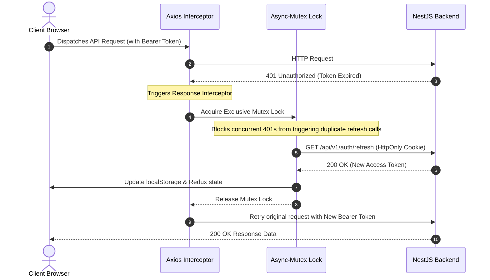
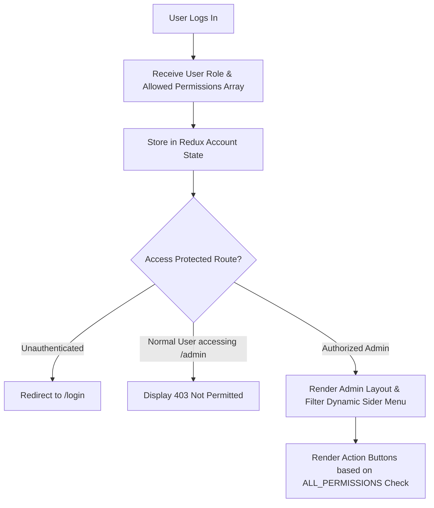

<div align="center">

# 💼 Jobs Hunter — Enterprise Recruitment & Career Portal

<p align="center">
  <strong>A modern, high-performance web platform bridging top talent and leading enterprises.</strong>
</p>

<p align="center">
  
  
  
  
  
  
</p>

---

[🚀 Introduction](#-introduction) •
[✨ Features](#-features) •
[🛠 Tech Stack](#-tech-stack) •
[📂 Project Structure](#-project-structure) •
[⚙️ Installation](#️-installation) •
[▶️ Usage](#️-usage) •
[🔌 API Integration](#-api-integration) •
[🧱 Architecture & Security](#-architecture--security) •
[🧪 Future Improvements](#-future-improvements) •
[👨‍💻 Author](#-author)

---

</div>

## 🚀 Introduction

**Jobs Hunter Frontend** is a production-ready Single Page Application (SPA) designed to deliver a seamless job search and talent acquisition experience. Built on top of **React 18**, **TypeScript**, and **Ant Design 5**, it provides an intuitive, high-speed interface for job seekers while offering a robust, permission-driven administrative management dashboard for hiring teams and system administrators.

The application communicates with a high-performance **NestJS RESTful API** backend, providing real-time data synchronization, automated file management, JWT authentication with silent token refresh, and dynamic Role-Based Access Control (RBAC).

---

## ✨ Features

### 👨‍💼 Candidate Portal (Client-Facing)

- **🔍 Smart Job Discovery & Filtering**: Search vacancies by keyword, location (Hanoi, Ho Chi Minh, Da Nang, etc.), and multi-select technology skills (React, Node.js, TypeScript, Java, etc.).
- **🏢 Company Showcase**: Browse company directories, explore detailed company profiles, office locations, and view active job openings.
- **📄 Instant CV / Resume Submission**: One-click application modal with interactive CV file upload (`.pdf`, `.doc`, `.docx`) supporting multipart form data.
- **📊 Real-time Application Tracking**: Candidate dashboard to review application history, track approval status (`PENDING`, `REVIEWING`, `APPROVED`, `REJECTED`), and view submission timelines.
- **🔔 Skill-Based Job Alert Subscription**: Candidates can subscribe their email address to specific tech stacks to receive curated job matches.
- **📱 Responsive Layout**: Fully adaptive navigation and layouts for desktop, tablet, and mobile screens.

### 🛡️ Admin & Enterprise Management Portal (RBAC)

- **📈 Interactive Metrics Dashboard**: Overview analytics displaying active users, job metrics, and platform performance with animated count-up visualizations (`react-countup`).
- **📝 Job Lifecycle Management (CRUD)**: Create and update job listings with rich-text job descriptions via **ReactQuill**, debounce company search, salary formatting, headcount, seniority levels (`INTERN`, `FRESHER`, `JUNIOR`, `MIDDLE`, `SENIOR`), and active date intervals.
- **🏢 Enterprise Company Directory**: Full company CRUD operations including logo upload, address mapping, and company descriptions.
- **👥 User & Identity Management**: Manage user profiles, contact information, role assignments, and company affiliations.
- **📥 Applicant Tracking System (ATS)**: Review candidate submissions, inspect uploaded resumes directly, update status workflows, and trace status change history logs.
- **🔑 Granular RBAC Permissions & Roles Matrix**:
  - Dynamically configure endpoint permissions (`GET`, `POST`, `PATCH`, `DELETE`) by module (`COMPANIES`, `USERS`, `JOBS`, `RESUMES`, `ROLES`, `PERMISSIONS`, `SUBSCRIBERS`).
  - Assemble custom roles by assigning permissions dynamically; the frontend dynamically shows/hides menus and actions based on current user capabilities.

### ⚡ Enterprise Client Capabilities

- **🔄 Race-Condition Safe Token Refresh**: Built-in Axios interceptor leveraging `async-mutex` to guarantee a single concurrent refresh token request during parallel API calls.
- **🔒 Protected Routes**: Multi-tiered route authorization guards with automated redirect for unauthenticated users and customized forbidden state (`403 Not Permitted`).
- **🎨 Modular Theming & Styling**: SCSS modules combined with Ant Design CSS-in-JS design tokens.

---

## 🛠 Tech Stack

| Domain | Technology / Library | Version | Description / Purpose |
| :--- | :--- | :--- | :--- |
| **Core Framework** | [React](https://react.dev/) | `18.2.0` | Declarative UI framework with Concurrent Mode support |
| **Language** | [TypeScript](https://www.typescriptlang.org/) | `5.3.3` | Strict static typing and enhanced developer tooling |
| **Build & Bundler** | [Vite](https://vitejs.dev/) + SWC | `4.2.0` | Ultra-fast build engine and Instant Hot Module Replacement (HMR) |
| **UI Component Suite** | [Ant Design](https://ant.design/) | `5.13.1` | Enterprise-grade component library |
| **Pro Components** | [@ant-design/pro-components](https://procomponents.ant.design/) | `2.6.46` | Advanced table layouts, editable forms, and toolbar primitives |
| **State Management** | [Redux Toolkit](https://redux-toolkit.js.org/) | `1.9.3` | Standardized, predictable global state container |
| **Routing** | [React Router DOM](https://reactrouter.com/) | `6.11.2` | Declarative client-side routing and nested layout loaders |
| **HTTP Client** | [Axios](https://axios-http.com/) | `1.6.5` | Promise-based HTTP client with request/response interceptors |
| **Concurrency Control** | [Async-Mutex](https://github.com/DirtyHairy/async-mutex) | `0.4.0` | Mutex locking for zero-race-condition token refreshing |
| **Rich Text Editor** | [React-Quill](https://github.com/zenoamaro/react-quill) | `2.0.0` | WYSIWYG editor for job requirements and job descriptions |
| **Date Manipulation** | [Day.js](https://day.js.org/) | `1.11.8` | Lightweight date-time parser, formatter, and relative time calculator |
| **Styling** | [Sass / SCSS Modules](https://sass-lang.com/) | `1.62.1` | Scoped and modular stylesheet architecture |

---

## 📂 Project Structure

```text
frontend/
├── public/                     # Static assets and favicons
├── src/
│   ├── assets/                 # Icons, vector graphics, and imagery
│   ├── components/
│   │   ├── admin/              # Admin dashboard modules & layout
│   │   │   ├── company/        # Company modal & CRUD components
│   │   │   ├── job/            # Job management & ReactQuill upsert forms
│   │   │   ├── permission/     # Permission matrix & module selectors
│   │   │   ├── resume/         # ATS resume review & status drawer
│   │   │   ├── role/           # Role creation & permission assignments
│   │   │   ├── user/           # User management & debounce select
│   │   │   └── layout.admin.tsx# Dynamic Sider/Header admin layout
│   │   ├── client/             # Candidate portal components
│   │   │   ├── card/           # Job and Company card grids
│   │   │   ├── modal/          # Apply CV modal & Manage Account modal
│   │   │   ├── header.client.tsx # Navigation header with search & profile
│   │   │   ├── footer.client.tsx # Portal footer
│   │   │   └── search.client.tsx # Multi-criteria search bar
│   │   └── share/              # Shared reusable components
│   │       ├── access.tsx      # Permission-based component guard
│   │       ├── loading.tsx     # Global loading indicator
│   │       ├── not.found.tsx   # 404 error page
│   │       ├── not-permitted.tsx # 403 forbidden access page
│   │       └── protected-route.ts # Route security wrappers
│   ├── config/
│   │   ├── api.ts              # Centralized backend API service calls
│   │   ├── axios-customize.ts  # Axios client with mutex token refresh
│   │   ├── permissions.ts      # Permission & module definitions
│   │   └── utils.ts            # Formatting utilities and skill catalogs
│   ├── pages/
│   │   ├── admin/              # Admin dashboard view pages
│   │   ├── auth/               # Login & Register views
│   │   ├── company/            # Company list & Company detail views
│   │   ├── home/               # Public landing page
│   │   └── job/                # Job board & Job detail views
│   ├── redux/
│   │   ├── slice/              # Redux slices (account, company, job, etc.)
│   │   ├── hooks.ts            # Typed useDispatch & useSelector hooks
│   │   └── store.ts            # Root Redux store configuration
│   ├── styles/                 # Global SCSS variables & module styles
│   ├── types/                  # TypeScript interface definitions (backend.d.ts)
│   ├── App.tsx                 # Root router & application provider
│   ├── main.tsx                # Application entry point
│   └── vite-env.d.ts           # Vite environment typing
├── .env.development            # Development environment variables
├── .env.production             # Production environment variables
├── package.json                # Project dependencies and scripts
├── tsconfig.json               # TypeScript compiler configuration
└── vite.config.ts              # Vite build and plugin configurations
```

---

## ⚙️ Installation

### 📋 Prerequisites

- **Node.js**: `v18.x` or higher
- **npm** (`v9.x`+) or **yarn** (`v1.22`+)
- **Backend API**: The [Jobs Hunter NestJS Backend](https://github.com/NguyenTanNghi/Jobs_Hunter_NestJS) service running locally or remotely.

### 1️⃣ Clone the Repository

```bash
git clone https://github.com/NguyenTanNghi/Jobs_Hunter_NestJS.git
cd Jobs_Hunter_NestJS/frontend
```

### 2️⃣ Install Dependencies

```bash
npm install
```

### 3️⃣ Configure Environment Variables

Create or update `.env.development` and `.env.production` in the root frontend directory:

```env
# .env.development
NODE_ENV=development
PORT=3000
VITE_BACKEND_URL=http://localhost:8000
```

```env
# .env.production
NODE_ENV=production
PORT=3000
VITE_BACKEND_URL=https://your-production-api-domain.com
```

---

## ▶️ Usage

### 🧑‍💻 Development Mode

Start the local Vite development server with Hot Module Replacement (HMR):

```bash
npm run dev
```

The application will be accessible at: `http://localhost:3000` (or the port defined in `.env`).

### 📦 Production Build

Compile TypeScript and build optimized static assets for production:

```bash
npm run build
```

### 🔍 Preview Production Build

Preview the production build locally before deploying:

```bash
npm run preview
```

---

## 🔌 API Integration

The frontend seamlessly connects to the NestJS backend via standard RESTful endpoints defined in `src/config/api.ts`:

| Module | HTTP Method | Endpoint | Description |
| :--- | :---: | :--- | :--- |
| **Auth** | `POST` | `/api/v1/auth/login` | Authenticate user & receive access token |
| | `POST` | `/api/v1/auth/register` | Register new candidate account |
| | `GET` | `/api/v1/auth/account` | Fetch current authenticated user profile & permissions |
| | `GET` | `/api/v1/auth/refresh` | Silent refresh access token using cookie refresh token |
| | `POST` | `/api/v1/auth/logout` | Revoke session & clear refresh cookie |
| **Companies** | `GET` | `/api/v1/companies` | Paginated company listings with search queries |
| | `POST` / `PATCH` | `/api/v1/companies` | Create or update company details |
| | `DELETE` | `/api/v1/companies/:id` | Soft delete company record |
| **Jobs** | `GET` | `/api/v1/jobs` | Paginated job postings with filter queries |
| | `GET` | `/api/v1/jobs/:id` | Retrieve detailed job specifications |
| | `POST` / `PATCH` | `/api/v1/jobs` | Upsert job posting with skills and salary |
| | `DELETE` | `/api/v1/jobs/:id` | Remove job vacancy |
| **Resumes** | `POST` | `/api/v1/resumes` | Submit candidate CV for a specific job |
| | `POST` | `/api/v1/resumes/by-user` | Retrieve application history for current user |
| | `PATCH` | `/api/v1/resumes/:id` | Update candidate application status (`ATS`) |
| **Files** | `POST` | `/api/v1/files/upload` | Upload logos and resumes via multipart form data |
| **Subscribers** | `POST` / `PATCH` | `/api/v1/subscribers` | Subscribe / update tech skill alerts for email |

---

## 🧱 Architecture & Security

### 🔄 Concurrency-Safe Silent Authentication Flow

To ensure uninterrupted user experience without unexpected session timeouts or race conditions, the frontend implements a **Mutex-protected Silent Token Refresh** mechanism:



### 🛡️ Role-Based Access Control (RBAC) Architecture



1. **Route Level Guards (`ProtectedRoute.tsx`)**: Validates authentication status and role hierarchy before rendering router outlets.
2. **Menu Level Filters (`layout.admin.tsx`)**: Sider menu items dynamically check if the required API path & method exist in `user.permissions`.
3. **Action Level Access (`access.tsx`)**: Granular buttons (Create, Edit, Delete) verify individual endpoint permissions before being rendered in the DOM.

---

## 🧪 Future Improvements

- [ ] **Real-time Notifications**: Integrate WebSocket / Socket.io for instant candidate status updates and interview invitations.
- [ ] **Dark Mode Theme**: Add dark/light mode toggle utilizing Ant Design's `theme.darkAlgorithm`.
- [ ] **Automated Testing Suite**: Introduce Unit & Integration testing with **Vitest** + **React Testing Library** and End-to-End (E2E) testing with **Playwright**.
- [ ] **AI-Powered Resume Matching**: Integrate AI recommendation algorithms to match candidate profiles with the most suitable vacancies.
- [ ] **Multi-language Support (i18n)**: Implement `react-i18next` for seamless switching between English and Vietnamese.

---

## 👨‍💻 Author

**Nguyễn Tấn Nghị**

- 🐙 GitHub: [@NguyenTanNghi](https://github.com/NguyenTanNghi)
- 💼 Project Repository: [Jobs_Hunter_NestJS](https://github.com/NguyenTanNghi/Jobs_Hunter_NestJS)
- 📧 Contact: [Email Author](mailto:nguyentannghi.dev@gmail.com)

---

<div align="center">
  <sub>Built with ❤️ using React 18, TypeScript, Ant Design, and Redux Toolkit.</sub>
</div>